# Awesome Decentralized Identity (DID & SSI) 🆔 Standard & Tools Ecosystem

  
  
  
  

## 📌 Top Decentralized Identity (DID) & Self-Sovereign Identity (SSI) Ecosystem

**A curated, production-grade directory of SaaS products, open-source frameworks, digital wallets, and developer tools for Decentralized Identifiers (DIDs), Verifiable Credentials (VCs), Zero-Knowledge Proofs (ZKPs), and eIDAS 2.0 digital identity infrastructure.**

📅 **Last updated:** October 2026

---

### 🌐 Market Intelligence & Sector Overview

> 📊 **Estimated Sector Market Size:** The global **Decentralized Identity (DID) & Self-Sovereign Identity (SSI)** market size is estimated at **$1.8 Billion in 2026** and is projected to expand to **over $15.5 Billion by 2030** (CAGR of ~70%), accelerated by regulatory mandates like **EU eIDAS 2.0 (EUDI Wallet)**, ISO 18013-5 Mobile Driving Licences (mDL), and enterprise zero-trust security adoption.
>
> 🧩 **Market Dynamics:** The sector is currently **highly fragmented**, characterized by open standards (W3C, DIF, ToIP, OIDC) alongside competing specialized infrastructure vendors, blockchain/cryptographic protocols, and sovereign national e-ID initiatives. It is not yet a "winner-take-all" market; enterprise interoperability and multi-format compliance (SD-JWT VC, W3C VC, mDL) remain key differentiators.

---

## 📑 Table of Contents

- [🏢 SaaS & Hosted Platforms](#-saas--hosted-platforms)
- [🔓 Open-Source GitHub Projects](#-open-source-github-projects)
  - [🚀 Full-Stack Identity Platforms](#-full-stack-identity-platforms)
  - [🛠️ Developer Frameworks & SDKs](#-developer-frameworks--sdks)
  - [📲 Wallets & Agents](#-wallets--agents)
- [📈 Star History](#-star-history)
- [🤝 How to Contribute](#-how-to-contribute)
- [💖 Support & Sponsorship](#-support--sponsorship)
- [⚖️ Disclaimer](#%EF%B8%8F-disclaimer)

---

## 🏢 SaaS & Hosted Platforms

Below is a curated comparison of leading commercial Decentralized Identity SaaS products, sorted by estimated company valuation/market capitalization (descending):

| SaaS Platform 🏢 | Valuation / Company Size 💰 | Starting Pricing Plan 💵 | Free Tier / Trial Limits 🎁 | Core Features & Description ⚡ |
| :--- | :--- | :--- | :--- | :--- |
| **[Civic](https://www.civic.com/)** 🛡️ | **$31.0M** (Market Cap) | $0.05 per verification (Pay-as-you-go) | **Free Developer Sandbox** with up to 100 test verifications/month | Web3 identity verification platform. Civic Pass enables on-chain identity and reusable KYC for DeFi, NFTs, and dApps without centralized biometric storage. |
| **[Spruce ID](https://www.spruceid.com/)** 🌲 | **~$100M - $250M** (Est. Valuation / $41.5M Funding) | $250/month (Enterprise Developer Tier) | **Forever Free Open-Source Core** & 30-day hosted sandbox trial | Enterprise & government-grade W3C identity toolkit. Provides digital credential issuance, DID infrastructure, and user-controlled data vaults (SSI). |
| **[Fractal ID](https://www.fractal.id/)** 🌀 | **$7.96M** (Total Funding) | $0.99 per user KYC verification | **14-Day Free Trial** (Includes 10 free KYC verifications for testing) | Decentralized identity & reusable KYC/AML platform for Web3. Provides compliant identity verification across multi-chain ecosystems. |
| **[cheqd](https://cheqd.io/)** 💳 | **$1.82M** (Market Cap) | $0.002 per DID transaction on-chain | **Free Testnet Access** & 50 free DID registrations on mainnet | Trusted data network & payment rails for decentralized identity. Enables monetization and payment infrastructure for credential issuance and verification. |
| **[Privado ID](https://privado.id/)** 🔐 | **Private / $30M Ecosystem Round** | $150/month (Managed Issuer Node) | **Forever Free Self-Hosted Core** & testnet playground access | Zero-knowledge identity protocol (formerly Polygon ID / Iden3). Enables privacy-preserving identity proofs using Circom ZK circuits with absolute data minimization. |
| **[Dock (Truvera)](https://www.dock.io/)** ⚓ | **Private Entity** (Dock Labs AG) | $49/month (Basic Issuer Plan) | **Free Tier** (Up to 50 credential issuances/month free forever) | Blockchain-anchored verifiable credential platform with selective disclosure capabilities. Certs platform lets organizations issue tamper-proof digital credentials. |
| **[Sphereon](https://sphereon.com/)** 🌐 | **Private Entity** (Bootstrap / EU Grants) | €199/month (Enterprise SDK Starter) | **30-Day Free Developer Trial** (Full access to SSI-SDK & Wallet APIs) | European SSI & Verifiable Credential infrastructure provider. Specializes in OID4VC modules, eIDAS 2.0 readiness, and enterprise wallet SDKs. |
| **[Affinidi](https://www.affinidi.com/)** 🔑 | **Private Enterprise** (Temasek-backed) | $0.01 per active monthly identity | **Forever Free Tier** (Up to 1,000 Monthly Active Users (MAUs)) | Decentralized identity and verifiable data platform providing developer-friendly TDKs for issuing, sharing, and verifying credentials. |

---

## 🔓 Open-Source GitHub Projects

The decentralized identity ecosystem has a mature, standards-driven open-source foundation anchored by W3C, DIF, and OpenWallet Foundation specifications. Below are production-ready open-source projects sorted by GitHub Stars_Counts (descending).

### 🚀 Full-Stack Identity Platforms

- **[hyperledger/indy-node](https://github.com/hyperledger/indy-node)**  📜
  **Distributed ledger purpose-built for decentralized identity.** Provides a self-sovereign identity ecosystem based on W3C DID specifications and verifiable credentials.

- **[walt-id/waltid-identity](https://github.com/walt-id/waltid-identity)**  ⚡
  **All-in-one open-source identity and wallet toolkit.** Multi-platform Kotlin/Java/JS implementation providing Issuer API (OID4VCI), Verifier API (OID4VP), and Wallet API supporting SD-JWT VC, W3C VC, and ISO 18013-5 mDL formats.

- **[credebl/platform](https://github.com/credebl/platform)**  🏛️
  **Open-source Decentralized Identity Platform—a Linux Foundation Decentralized Trust project and UN-endorsed Digital Public Good.** Powers national digital ID infrastructure for the Royal Government of Bhutan and Papua New Guinea using micro-services architecture for population-scale SSI.

- **[swiyu-admin-ch/eidch-android-wallet](https://github.com/swiyu-admin-ch/eidch-android-wallet)**  🇨🇭
  **Swiss Trust Infrastructure published by the Swiss Confederation under open-source licences.** Includes official Android/iOS wallets for the Swiss e-ID, Generic Verifier (OID4VP), Generic Issuer (OID4VCI), and DID Toolbox.

---

### 🛠️ Developer Frameworks & SDKs

- **[uport-project/veramo](https://github.com/uport-project/veramo)**  📦
  **Open-source JavaScript framework for verifiable data and decentralized identity.** Successor to uPort. Zero biometric collection, zero data retention, and modular support for did:web, did:key, and did:ethr.

- **[hyperledger/aries-cloudagent-python](https://github.com/hyperledger/aries-cloudagent-python)**  🐍
  **Foundation for building SSI agents and cloud services.** Hyperledger Aries Cloud Agent Python (ACA-Py) handles DIDComm messaging and verifiable credential workflows.

- **[decentralized-identity/did-jwt](https://github.com/decentralized-identity/did-jwt)**  🔐
  **Signed JSON Web Tokens for Decentralized Identifiers.** Core DIF library for signing and verifying JWTs encoded with DIDs.

- **[openwallet-foundation/credo-ts](https://github.com/openwallet-foundation/credo-ts)**  🌐
  **TypeScript framework for building SSI agents and digital wallets.** Part of OpenWallet Foundation (formerly Aries Framework JavaScript).

- **[Sphereon-Opensource/SSI-SDK](https://github.com/Sphereon-Opensource/SSI-SDK)**  🛠️
  **TypeScript Self-Sovereign Identity SDK.** Features modules for OID4VCI, OID4VP, SIOP-OID4VP, and enterprise wallet management.

- **[transmute-industries/transmute](https://github.com/transmute-industries/transmute)**  💎
  **Open-source Decentralized Identifiers & Verifiable Credentials infrastructure.** Tools for JSON-LD, cryptographic suites, and web credential management.

---

### 📲 Wallets & Agents

- **[procivis/one-wallet](https://github.com/procivis/one-wallet)**  📱
  **Digital wallet compliant with eIDAS 2.0 standards.** Supports ISO 18013-5 mdocs, IETF SD-JWT VC, OID4VC, and W3C VCs.

- **[cardano-foundation/cf-identity-wallet](https://github.com/cardano-foundation/cf-identity-wallet)**  💳
  **Open-source mobile identity wallet.** Developed by Cardano Foundation for securely storing and sharing verifiable credentials.

- **[impierce/identity-wallet](https://github.com/impierce/identity-wallet)**  🦀
  **Tauri and Rust-based identity wallet.** Cross-platform desktop and mobile wallet for managing DIDs and Verifiable Credentials.

- **[bcgov/aries-vcr](https://github.com/bcgov/aries-vcr)**  🏛️
  **Verifiable Credential Registry (VCR).** Software components developed by British Columbia government for entity credential registration.

- **[bcgov/traction](https://github.com/bcgov/traction)**  🚀
  **API-first tenant management for ACA-Py.** Accelerates digital credential adoption for enterprise and government agencies.

- **[animo/paradym-wallet](https://github.com/animo/paradym-wallet)**  🎒
  **Open-source wallet app.** Designed for effortless credential presentations and holder interaction.

---

## 📈 Star History

---

## 🤝 How to Contribute

Contributions are always welcome! 

1. Fork this repository.
2. Create a new branch (`git checkout -b feature/add-new-did-tool`).
3. Add your entry following the tabular / badge format.
4. Ensure descriptions remain objective and factual.
5. Open a Pull Request!

For a full list of curated awesome lists, check out [Awesome-Awesome-Awesome](https://github.com/ishandutta2007/Awesome-Awesome-Awesome).

---

## 💖 Support & Sponsorship

If you find this repository helpful for your research, project development, or enterprise digital identity architecture, please consider:

- ⭐ **Starring this repository** to help others discover it!
- 🔀 **Sharing it** with identity architects and developers.
- ☕ **Sponsoring the project** to support continuous updates:

---

## ⚖️ Disclaimer

- This is a community-curated directory intended for research and educational purposes.
- Decentralized identity platforms process cryptographic and personal identity credentials. Always verify compliance with relevant regional privacy legislation (e.g., GDPR, eIDAS 2.0, CCPA).
